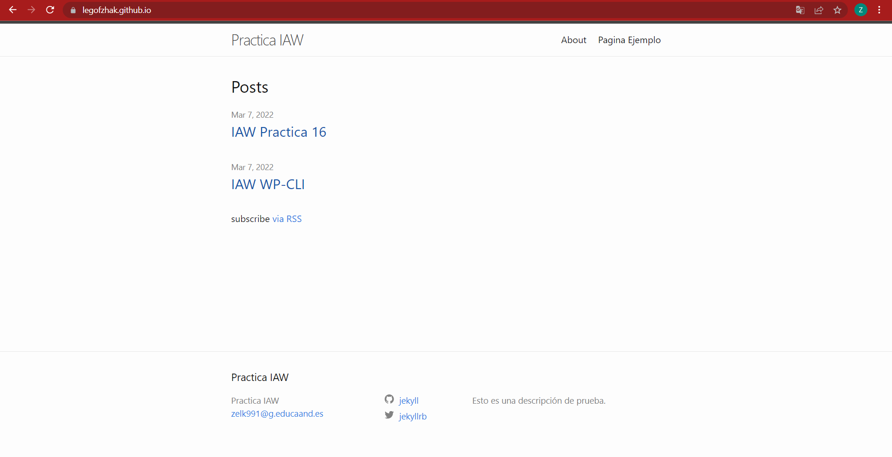

# legofzhak.github.io

## Práctica para crear un blog de ejemplo con Jekyll y GitHub Pages.
---

    Sitio: https://legofzhak.github.io/


1. Este comando nos permite crear la estructura de directorios y los archivos necesarios de un nuevo proyecto Jekyll.

    ```
    docker run -it --rm -v "$PWD:/srv/jekyll" jekyll/jekyll jekyll new blog
    ```

2. Este comando nos permite servir de forma local un sitio HTML estático generado a partir del contenido del proyecto Jekyll.

    ```
    docker run -it --rm -p 4000:4000 -v "$PWD:/srv/jekyll" jekyll/jekyll jekyll serve --force_polling  
    ```

    La opción --force_polling permite que el contenido del sitio se vaya generando automáticamente cuando existe algún cambio en los archivos del proyecto.

    Nota: Tenga en cuenta que este comando tendrá que ejecutarlo dentro del directorio donde tenga el contenido del blog.

    Para ver nuestro sitio web sólo tenemos que abrir un navegador web y acceder a la dirección de localhost en el puerto 4000:

    http://localhost:4000

    También podríamos acceder a través de la dirección IP de nuestra máquina.